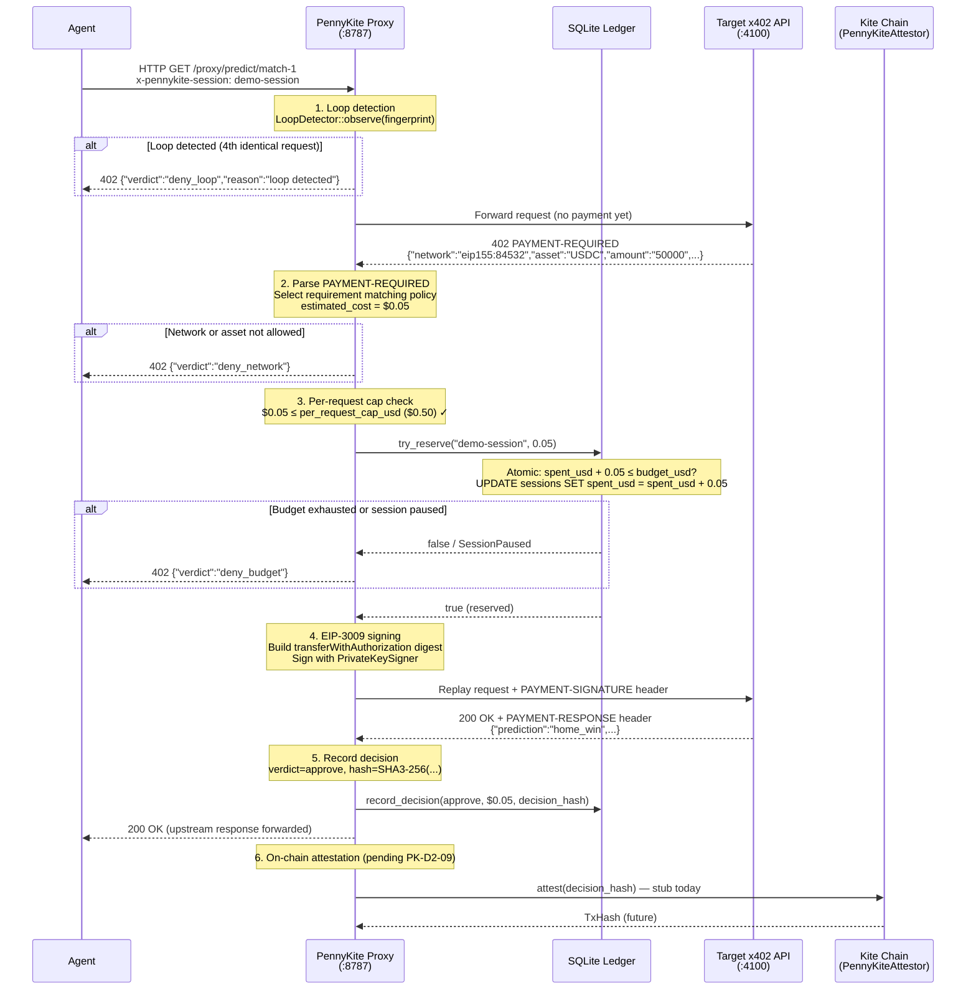

# x402 Protocol Flow in PennyKite

This document explains how PennyKite intercepts and governs x402 micropayments, covering the full request lifecycle from agent to upstream and back.

---

## x402 primer

[x402](https://github.com/coinbase/x402) is a payment protocol layered on top of HTTP. It reuses HTTP 402 Payment Required as a machine-readable signal that an API endpoint requires a payment before serving a response.

The core exchange:

1. Client makes an HTTP request without a payment.
2. Server responds `402 PAYMENT-REQUIRED` with a `PAYMENT-REQUIRED` header containing a JSON-encoded payment specification (price, asset, network, pay-to address, facilitator URL).
3. Client signs an EIP-3009 `transferWithAuthorization` — an off-chain, gasless authorisation for a specific USDC transfer.
4. Client replays the original request with a `PAYMENT-SIGNATURE` header.
5. Server verifies the signature via the x402 facilitator and delivers the response.

PennyKite sits between steps 2 and 3, deciding whether to sign on the agent's behalf.

---

## Full request sequence



---

## EIP-3009: gasless payment authorisation

x402 payments use EIP-3009 `transferWithAuthorization`, not a standard ERC-20 `transfer`. This matters because:

- **Gasless for the agent.** The agent never submits an on-chain transaction. The payment is authorised off-chain and executed by the facilitator.
- **Atomic and non-replayable.** Each authorisation includes `from`, `to`, `value`, `validAfter`, `validBefore`, and a `nonce`. The nonce is a random 32-byte value; the facilitator rejects any replay.
- **EIP-712 typed data.** The digest follows EIP-712 domain separation, binding the signature to a specific chain ID and USDC contract address.

PennyKite's signing code lives in `crates/pennykite-providers/src/eip3009.rs`. It:
1. Builds the `TransferWithAuthorization` struct with the payment parameters from the `PAYMENT-REQUIRED` header.
2. Computes the EIP-712 digest using the chain ID and USDC contract address configured at proxy startup.
3. Signs with the `PrivateKeySigner` loaded from `--private-key`.
4. Serializes the 65-byte signature as `0x...` hex and sets it as the `PAYMENT-SIGNATURE` header for the replay request.

---

## PAYMENT-REQUIRED header format

The upstream returns a base64-encoded JSON payload in the `PAYMENT-REQUIRED` header:

```json
{
  "version": "1.0",
  "requirements": [
    {
      "network": "eip155:84532",
      "asset": "USDC",
      "amount": "50000",
      "decimals": 6,
      "pay_to": "0x000000000000000000000000000000000000dEaD",
      "facilitator": "https://facilitator.x402.example.com"
    }
  ],
  "expires_at": "2026-05-25T12:00:00Z"
}
```

PennyKite parses this into a `PaymentRequired` struct (`pennykite-types`) and selects the requirement whose `network` and `asset` match the policy's `networks.allowed` and `assets.allowed` lists.

---

## Deny flow: session paused

When an operator pauses a session via the dashboard kill-switch:

```
POST /api/sessions/demo-session/pause
        │
        ▼
Dashboard Next.js bridge
        │
        ▼
Proxy: ledger.pause_session("demo-session")
        │ status = 'paused' in SQLite
        ▼
Next agent request:
Proxy: try_reserve("demo-session", 0.05)
        │ → LedgerError::SessionPaused
        ▼
402 Payment Required
{"reason":"session is paused"}
```

The pause takes effect immediately on the next request. No on-chain transaction is required for the SQLite-level block. Real Kite Passport session-key revocation is `mock_pending` (see `kite-integration.md`).

---

## Loop detection sequence

The loop detector runs *before* the upstream request is forwarded, so a detected loop costs zero upstream traffic. In v0.1, similarity is exact-field matching over `(method, host, path, body_hash)`; identical requests score `1.0`, which exceeds the default `0.85` threshold:

```
Agent sends request #4 (identical to #1, #2, #3)
        │
        ▼
LoopDetector::observe(fingerprint)
        │ window = [fp1, fp2, fp3, fp4]
        │ similarity(fp4, fp3) = 1.0 > 0.85 threshold
        │ similarity(fp4, fp2) = 1.0 > 0.85 threshold
        │ similarity(fp4, fp1) = 1.0 > 0.85 threshold
        │ max_consecutive_similar (3) exceeded
        ▼
return true (loop detected)
        │
        ▼
Record Decision(verdict=deny_loop, cost=$0.00, hash=SHA3-256(...))
        │
        ▼
402 {"verdict":"deny_loop","reason":"loop detected"}
```

The upstream never sees requests 4+. Budget remains unspent.

---

## Network policy enforcement

Before forwarding, the proxy checks:

1. Does the upstream's `PAYMENT-REQUIRED` network (e.g. `eip155:84532`) appear in `policy.networks.allowed`?
2. Does the asset (e.g. `USDC`) appear in `policy.networks.assets`?

If either check fails, the proxy returns `402 {"verdict":"deny_network"}` immediately — again before any payment is attempted.

---

## Key invariants

| Invariant | How it is upheld |
|---|---|
| No double-spend on concurrent requests | `try_reserve` runs inside a SQLite exclusive transaction |
| Paused sessions cannot make payments | `try_reserve` checks `status` before updating `spent_usd` |
| Every decision leaves an audit record | `record_decision` is called on all code paths (approve and deny) |
| Loop-blocked requests cost nothing | Loop check runs before upstream forwarding |
| Pre-execution cost known before signing | Proxy reads `PAYMENT-REQUIRED` before constructing the EIP-3009 signature |
